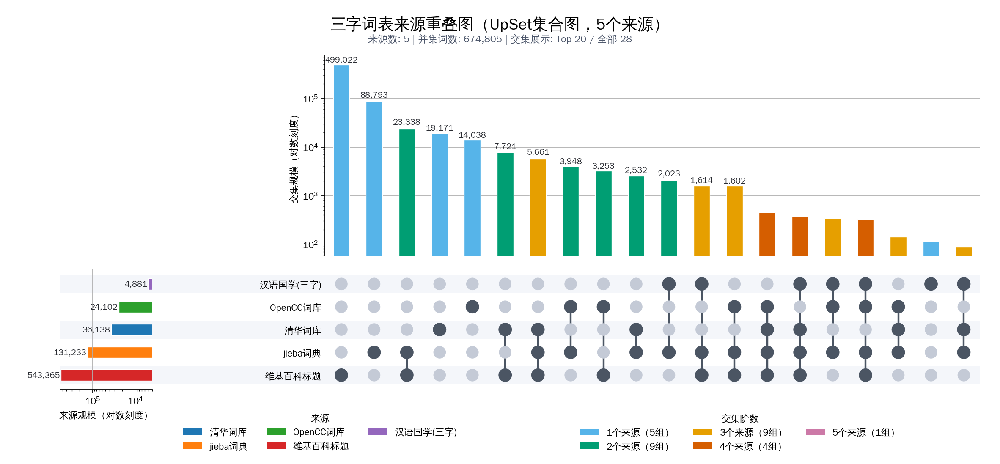
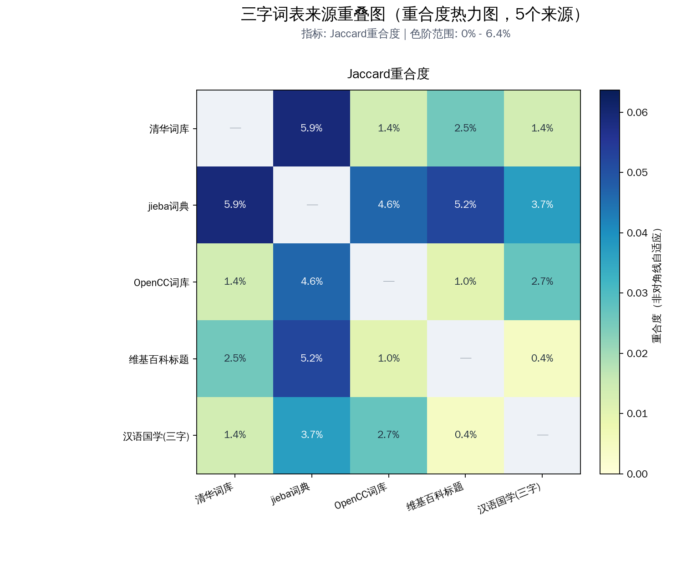

# wordlist-pipeline

用于构建“中文三字词表”的可复现流水线项目。  
核心流程：下载多源词库 -> 抽取 -> 规范化 -> 三字过滤 -> 合并 -> 质检报告。

## 项目特点

- 多数据源统一处理（THUOCL / jieba / OpenCC / zhwiki / 汉语国学抓取）
- 全流程可复现（`make all`）
- 支持按来源筛选合并（`MERGE_INCLUDE / MERGE_EXCLUDE`）
- 支持交互式选源（`make mergei`）
- 支持多图表展示（UpSet / 热力图 / Venn）

## 快速开始

```bash
uv sync --extra viz
uv run make all
uv run make plots
```

默认产物：

- `out/3zi_words.txt`：最终三字词表
- `out/report.json`：质检报告
- `docs/plots/source_overlap.upset.png`：UpSet 图
- `docs/plots/source_overlap.overlap.png`：重合度热力图

## 图表展示

<table>
  <tr>
    <td align="center"><b>UpSet 集合图</b></td>
    <td align="center"><b>重合度热力图</b></td>
  </tr>
  <tr>
    <td width="50%"></td>
    <td width="50%"></td>
  </tr>
</table>

说明：

- UpSet：看交集数量结构（哪些来源组合贡献最大）
- 热力图：看来源两两重合比例（默认 Jaccard）

## 文档索引

- 总览文档：[`docs/README.md`](docs/README.md)
- 数据源文档：清华词库（THUOCL）[`docs/sources/THUOCL.md`](docs/sources/THUOCL.md)
- 数据源文档：jieba词典（jieba）[`docs/sources/jieba.md`](docs/sources/jieba.md)
- 数据源文档：OpenCC词库（OpenCC）[`docs/sources/OpenCC.md`](docs/sources/OpenCC.md)
- 数据源文档：维基百科标题（zhwiki_titles_ns0_gz）[`docs/sources/zhwiki_titles_ns0_gz.md`](docs/sources/zhwiki_titles_ns0_gz.md)
- 数据源文档：汉语国学(三字)（hanyuguoxue_changdu3_top50）[`docs/sources/hanyuguoxue_changdu3_top50.md`](docs/sources/hanyuguoxue_changdu3_top50.md)

## 安装说明

环境要求：

- Python >= 3.10
- uv（建议最新版）
- Bash（执行 `scripts/download.sh`）
- 网络访问（拉取 GitHub/Wikimedia/汉语国学网页）

基础依赖：

```bash
uv sync
```

可视化依赖：

```bash
uv sync --extra viz
```

## Make 命令

- `make download`：下载/抓取所有原始源到 `data/raw`
- `make extract`：抽取到 `data/stage1_extracted`
- `make normalize`：规范化到 `data/stage2_normalized`
- `make filter`：筛选为严格三字词到 `data/stage3_filtered`
- `make merge`：合并生成 `out/3zi_words.txt`
- `make qc`：生成 `out/report.json`
- `make sources`：查看来源状态、数量与引用信息
- `make stats`：查看集合统计（并集、交集、独占等）
- `make venn`：输出单张图到 `out/source_overlap.png`（默认 `upset`）
- `make plots`：批量输出图表到 `docs/plots/`
- `make mergei`：交互式选择来源并合并
- `make qci`：交互式合并后立即做 QC
- `make clean`：清理 `data/`、`out/`、`.tmp/`

## 常用命令

按来源筛选合并：

```bash
make merge MERGE_INCLUDE=THUOCL,jieba,OpenCC
make merge MERGE_EXCLUDE=zhwiki_titles_ns0_gz
```

查看统计和来源状态：

```bash
make sources
make stats
```

生成展示图（推荐）：

```bash
make plots
make plots PLOT_TYPES=upset,overlap
make plots PLOT_TYPES=overlap PLOT_OVERLAP_METRIC=containment
```

`PLOT_TYPES` 支持：`venn,upset,overlap,auto,all`。  
对应输出示例：

- `docs/plots/source_overlap.upset.png`
- `docs/plots/source_overlap.overlap.png`
- `docs/plots/source_overlap.venn.png`（仅来源数 <= 3 且模式包含 venn/all）

单独调用绘图脚本：

```bash
uv run python scripts/plot_sources_venn.py --mode upset --max-intersections 0
uv run python scripts/plot_sources_venn.py --mode overlap --overlap-metric overlap
uv run python scripts/plot_sources_venn.py --mode overlap --overlap-metric containment
```

## 数据源定义

`sources/sources.txt` 每行 3 列：

```text
type  name  ref_or_url
```

当前内置：

- `git THUOCL`
- `git jieba`
- `git OpenCC`
- `url zhwiki_titles_ns0_gz`
- `gen hanyuguoxue_changdu3_top50`

新增来源后：

1. 在 `sources/sources.txt` 增加一行
2. 把原始文件放到 `data/raw/<name>.txt`（或在 `extract.py` 增加解析逻辑）
3. 运行 `make extract normalize filter merge qc`

数据源详情见 `docs/README.md`。

## 关键脚本

- `scripts/extract.py`：多源抽取到统一格式
- `scripts/normalize.py`：去空白、去重、排序
- `scripts/filter_3zi.py`：仅保留 3 个汉字词条
- `scripts/wordlist.py`：来源管理 / 统计 / 合并
- `scripts/plot_sources_venn.py`：绘图（`venn / upset / overlap / all`）
- `scripts/qc.py`：生成质检报告

## 常见问题

- 下载慢或失败：重试 `make download`，必要时配置代理
- `stage3` 不存在：先执行 `make filter` 或 `make all`
- 词数变化较大：检查 `MERGE_INCLUDE / MERGE_EXCLUDE` 或上游源更新

## License

本仓库代码采用 [MIT License](LICENSE)。  
各第三方数据源与词库遵循其各自许可证，请在使用前自行核对。
